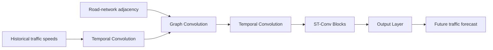

<div align="center">

# Spatio-Temporal Graph Convolutional Networks (STGCN)
### Study / Reproduction Repository for Traffic Forecasting


</div>

> **Attribution note.** This repository is a study/reproduction copy of the public **STGCN PyTorch implementation associated with `hazdzz/STGCN`**, which itself implements the IJCAI 2018 paper *Spatio-Temporal Graph Convolutional Networks: A Deep Learning Framework for Traffic Forecasting* by **Bing Yu, Haoteng Yin, and Zhanxing Zhu**. It is **not an original STGCN method authored by Bo Liu**. The original paper, source attribution, license, and upstream implementation context are preserved below.

## About STGCN

STGCN models traffic networks as graphs: road sensors are nodes, spatial connectivity is encoded by an adjacency matrix, and historical traffic measurements form time-varying node features. The architecture alternates temporal convolutions and graph convolutions to capture both short-term temporal dependencies and spatial propagation over the road network.

<p align="center">
  
</p>

<p align="center"><em>STGCN model structure included in the upstream implementation.</em></p>

## Conceptual Pipeline



## Graph Construction

The repository uses weighted adjacency matrices to represent sensor/road connectivity. The included preprocessing illustration is:

<p align="center">
  
</p>

The preprocessing follows the graph-filtering ideas referenced by the upstream project and ChebNet-related graph convolution literature.

## Datasets Included

The repository contains prepared data directories for three common traffic benchmarks:

| Dataset | Repository path | Contents |
| --- | --- | --- |
| METR-LA | `data/metr-la/` | `vel.csv`, `adj.npz` |
| PEMS-BAY | `data/pems-bay/` | `vel.csv`, `adj.npz` |
| PeMSD7(M) | `data/pemsd7-m/` | `vel.csv`, `adj.npz` |

The original README referenced the following sources:

- METR-LA and PEMS-BAY from DCRNN-related data releases;
- PeMSD7(M) from the original STGCN repository.

Please follow the respective dataset licenses and source terms when using them.

## Repository Structure

```text
stgcn/
├── data/
│   ├── metr-la/
│   ├── pems-bay/
│   └── pemsd7-m/
├── figure/
│   ├── stgcn_model_structure.png
│   └── weighted_adjacency_matrix.png
├── model/
│   ├── layers.py             # Graph/temporal convolution building blocks
│   └── models.py             # STGCN model definitions
├── script/
│   ├── dataloader.py
│   ├── earlystopping.py
│   ├── opt.py
│   └── utility.py
├── main.py                   # Training/evaluation entry point
├── requirements.txt
├── LICENSE
└── README.md
```

## Upstream Implementation Features

The upstream README describes several engineering differences from the original authors' release, including:

- bug fixes;
- early stopping;
- dropout;
- alternative hyperparameter settings;
- configurations for Chebyshev graph convolution and standard graph convolution;
- METR-LA and PEMS-BAY support;
- a different preprocessing pipeline.

These points belong to the upstream implementation history and **should not be interpreted as contributions made by Bo Liu**.

## Installation

```bash
pip install -r requirements.txt
```

## Running

The main experiment entry is:

```bash
python main.py --help
```

Use the options defined in `script/opt.py` to select dataset, graph-convolution type, temporal settings, optimization parameters, and other experiment choices. Since this is an older reproduction repository, dependency versions may require adjustment on current PyTorch/Python environments.

## Paper

**Bing Yu, Haoteng Yin, Zhanxing Zhu.**  
*Spatio-Temporal Graph Convolutional Networks: A Deep Learning Framework for Traffic Forecasting.*  
Proceedings of IJCAI 2018, pp. 3634–3640.  
Paper: https://arxiv.org/abs/1709.04875

## Citation

Please cite the original STGCN paper when using this method:

```bibtex
@inproceedings{yu2018stgcn,
  author    = {Yu, Bing and Yin, Haoteng and Zhu, Zhanxing},
  title     = {Spatio-Temporal Graph Convolutional Networks: A Deep Learning Framework for Traffic Forecasting},
  booktitle = {Proceedings of the 27th International Joint Conference on Artificial Intelligence},
  pages     = {3634--3640},
  year      = {2018},
  publisher = {AAAI Press}
}
```

## Related Foundations

The upstream project also points to several foundational methods used by or related to STGCN:

- Temporal Convolutional Networks (TCN)
- GLU / GTU gated convolution
- ChebNet spectral graph convolution
- Graph Convolutional Networks (GCN)

## Why This Repository Is in My Profile

I keep this repository as an early **spatiotemporal graph-learning study/reproduction environment**. Graph-based traffic forecasting was part of the technical foundation that later led to my research in graph learning, diffusion models, spatiotemporal intelligence, LLM reasoning, and Agentic AI.

## Maintainer Note

This GitHub copy is maintained under **BoLiupro** for study/archive purposes. For the STGCN method and implementation lineage, please credit the original paper authors and upstream implementation rather than this profile.
